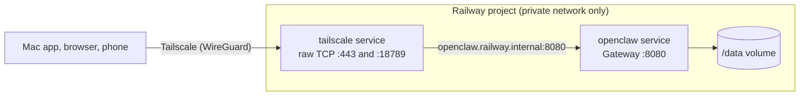

# OpenClaw on Railway

[](https://railway.com/deploy/openclaw-private-gateway?utm_medium=integration&utm_source=button&utm_campaign=openclaw-private-gateway)

A minimal Railway deployment of the [OpenClaw](https://openclaw.ai) Gateway,
reachable only through Tailscale.

- **OpenClaw 2026.9.8**, the official image pinned by digest. Upgrading OpenClaw
  means changing one `FROM` line.
- **The Gateway is the process.** No setup server, reverse proxy, or supervisor.
  A short entrypoint prepares the volume and drops root before OpenClaw's own
  startup runs.
- **Private by default.** No Railway domain. A separate Tailscale service
  forwards raw TCP from your tailnet to the Gateway over Railway's private
  network, so no forwarded headers exist to trust or spoof, and OpenClaw's
  proxy-attribution check stays fully on.
- **All state on one volume** at `/data`: OpenClaw's state in `/data/.openclaw`
  (migrated by OpenClaw's own Doctor on every start), plus the home directory
  and Homebrew, so tool logins and updates survive redeploys.
- **Tools for skills included.** `gh`, `gog`, Claude Code, Codex, `jq`, and
  `tmux` ship as a pinned baseline; Homebrew and `npm install -g` add or update
  tools on the volume.



## Deploy

**[QUICKSTART.md](documentation/QUICKSTART.md)**: deploy the Railway template,
give it your tailnet address and a Tailscale auth key, then onboard a model
provider and pair the Mac app. About 15 minutes.

[DEPLOYMENT.md](documentation/DEPLOYMENT.md) does the same from your own fork
with Railway Infrastructure as Code (`.railway/railway.ts`).

## Documentation

| Document | What it covers |
| --- | --- |
| [QUICKSTART.md](documentation/QUICKSTART.md) | Template deploy to a paired Mac app in about 15 minutes |
| [DEPLOYMENT.md](documentation/DEPLOYMENT.md) | Step-by-step deployment and onboarding; publishing as a Railway template |
| [ARCHITECTURE.md](documentation/ARCHITECTURE.md) | Design, access options compared, why proxy attribution can't fail, what Railway owns |
| [CONFIGURATION.md](documentation/CONFIGURATION.md) | Every variable and setting, build-time vs runtime, what lives on the volume |
| [TOOLS.md](documentation/TOOLS.md) | CLI tools for skills, logging them in, keeping them current, adding more |
| [TAILSCALE.md](documentation/TAILSCALE.md) | Access policy, auth keys, tags, key expiry, rotation |
| [DESKTOP.md](documentation/DESKTOP.md) | Connecting and pairing the macOS app |
| [SECURITY.md](documentation/SECURITY.md) | Infrastructure controls, the security audit, recommended agent policy |
| [UPGRADING.md](documentation/UPGRADING.md) | Upgrades, backups, rollbacks |
| [TROUBLESHOOTING.md](documentation/TROUBLESHOOTING.md) | Symptoms and fixes |
| [ACCEPTANCE_CRITERIA.md](documentation/ACCEPTANCE_CRITERIA.md) | What is verified, what still needs a live deployment |

## Repository

| Path | Purpose |
| --- | --- |
| `Dockerfile` | OpenClaw image: official base, entrypoint, seed config, skill tools, Homebrew seed |
| `scripts/entrypoint.sh` | Environment checks, volume preparation, first-boot seeding, privilege drop |
| `scripts/as-node.sh` | `as-node <command>`: run a command as `node` from a root `railway ssh` shell |
| `scripts/openclaw-as-node.sh` | Runs the OpenClaw CLI through `as-node` |
| `scripts/brew-as-node.sh` | Runs Homebrew through `as-node` (Homebrew refuses root) |
| `config/openclaw.seed.json` | Baseline config, written on first boot only |
| `tools/` | Pinned npm tools for skills (Claude Code); Dependabot proposes updates |
| `tailscale/Dockerfile` | Official Tailscale image and Serve config |
| `tailscale/serve.json` | Raw TCP forwards to `openclaw.railway.internal:8080` |
| `.railway/railway.ts` | Railway Infrastructure as Code: two services, two volumes |
| `.env.example` | Runtime variables for both services (documentation only) |
| `tests/` | Image integration tests, IaC tests, Serve config check |
| `documentation/` | Guides listed above |
| `.github/` | CI and Dependabot |

## Test

```bash
npm ci
npm run typecheck && npm run test:railway-config
sh tests/serve-config.test.sh   # needs Docker
npm run test:image              # needs Docker; builds and exercises both images
```

## License

[MIT](LICENSE)
