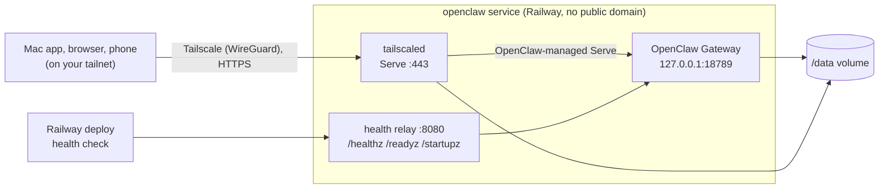

# OpenClaw on Railway

[](https://railway.com/deploy/openclaw-private-gateway?utm_medium=integration&utm_source=button&utm_campaign=openclaw-private-gateway)

A minimal Railway deployment of the [OpenClaw](https://openclaw.ai) Gateway,
reachable only through Tailscale.

- **OpenClaw 2026.9.8**, the official image pinned by digest. Upgrading OpenClaw
  means changing one `FROM` line.
- **The Gateway is the main process.** No setup server or reverse proxy. A
  short entrypoint prepares the volume, logs Tailscale in on first boot, and
  drops root before OpenClaw's own startup runs. A small sidecar runs
  `tailscaled` and relays Railway's health check.
- **Private by default.** No Railway domain. Tailscale runs in the same
  container, and OpenClaw manages Tailscale Serve itself: the Gateway listens
  only on loopback, Serve publishes it at `https://openclaw.<tailnet>.ts.net`,
  and browsers on your tailnet sign in with their Tailscale identity. Nothing
  else in the Railway project can reach it.
- **One service, one variable.** The template asks only for a Tailscale auth
  key; the Gateway token is generated.
- **All state on one volume** at `/data`: OpenClaw's state in `/data/.openclaw`
  (migrated by OpenClaw's own Doctor on every start), Tailscale's node state,
  the home directory, and Homebrew, so the machine identity, tool logins, and
  updates survive redeploys.
- **Tools for skills included.** `gh`, `gog`, Claude Code, Codex, `jq`, `tmux`,
  and ImageMagick (for iPhone HEIC photos) ship as a pinned baseline; Homebrew
  and `npm install -g` add or update tools on the volume.
- **Opt-in webhooks.** With a Railway domain and `OPENCLAW_RAILWAY_WEBHOOKS=on`,
  outside services can call `POST /hooks/<name>` and Gmail can push new mail,
  while the dashboard stays tailnet-only. See [WEBHOOKS.md](documentation/WEBHOOKS.md).



## Deploy

**[QUICKSTART.md](documentation/QUICKSTART.md)**: deploy the Railway template,
give it a Tailscale auth key, then onboard a model provider and pair the Mac
app. About 15 minutes.

[DEPLOYMENT.md](documentation/DEPLOYMENT.md) does the same from your own fork
with Railway Infrastructure as Code (`.railway/railway.ts`).

## Documentation

| Document | What it covers |
| --- | --- |
| [QUICKSTART.md](documentation/QUICKSTART.md) | Template deploy to a paired Mac app in about 15 minutes |
| [DEPLOYMENT.md](documentation/DEPLOYMENT.md) | Step-by-step deployment and onboarding; publishing as a Railway template |
| [ARCHITECTURE.md](documentation/ARCHITECTURE.md) | Design, access options compared, why proxy attribution can't fail, what Railway owns |
| [CONFIGURATION.md](documentation/CONFIGURATION.md) | Every variable and setting, build-time vs runtime, what lives on the volume |
| [TOOLS.md](documentation/TOOLS.md) | CLI tools for skills, logging them in, keeping them current, adding more |
| [WEBHOOKS.md](documentation/WEBHOOKS.md) | Opt-in public webhooks and Gmail push, with a restricted reader agent |
| [TAILSCALE.md](documentation/TAILSCALE.md) | Access policy, auth keys, tags, key expiry, rotation |
| [DESKTOP.md](documentation/DESKTOP.md) | Connecting and pairing the macOS app |
| [SECURITY.md](documentation/SECURITY.md) | Infrastructure controls, the security audit, recommended agent policy |
| [UPGRADING.md](documentation/UPGRADING.md) | Upgrades, backups, rollbacks |
| [TROUBLESHOOTING.md](documentation/TROUBLESHOOTING.md) | Symptoms and fixes |
| [RAILWAY_TEMPLATE.md](documentation/RAILWAY_TEMPLATE.md) | The published template's readme, as shown on the Railway template page |
| [ACCEPTANCE_CRITERIA.md](documentation/ACCEPTANCE_CRITERIA.md) | What is verified, what still needs a live deployment |

## Repository

| Path | Purpose |
| --- | --- |
| `Dockerfile` | OpenClaw image: official base, Tailscale binaries, entrypoint, seed config, skill tools, Homebrew seed |
| `scripts/entrypoint.sh` | Environment checks, volume preparation, first-boot seeding, Tailscale login, privilege drop |
| `scripts/gog-login.sh` | `gog-login`: Google sign-in for the gog skill through the tailnet (see [TOOLS.md](documentation/TOOLS.md#google-gog)) |
| `scripts/sidecar.mjs` | Runs `tailscaled` (stops the container if it exits) and relays Railway's health check to the loopback Gateway |
| `scripts/webhook-relay.mjs` | Opt-in webhook routes on the same port: token check, lockout, size cap |
| `scripts/as-node.sh` | `as-node <command>`: run a command as `node` from a root `railway ssh` shell |
| `scripts/openclaw-as-node.sh` | Runs the OpenClaw CLI through `as-node` |
| `scripts/brew-as-node.sh` | Runs Homebrew through `as-node` (Homebrew refuses root) |
| `config/openclaw.seed.json` | Baseline config, written on first boot only |
| `tools/` | Pinned npm tools for skills (Claude Code); Dependabot proposes updates |
| `.railway/railway.ts` | Railway Infrastructure as Code: one service, one volume |
| `.env.example` | Runtime variables (documentation only) |
| `tests/` | Image integration tests, IaC tests |
| `documentation/` | Guides listed above |
| `.github/` | CI and Dependabot |

## Test

```bash
npm ci
npm run typecheck && npm run test:railway-config
npm run test:image              # needs Docker; builds and exercises the image
```

The image tests need no tailnet: they run the Gateway with Tailscale skipped and
check the relay, authentication, persistence, and failure handling. To also log
a real node in to your tailnet and check Tailscale Serve end to end, set
`TAILSCALE_TEST_AUTHKEY` to a reusable, ephemeral auth key
(`TAILSCALE_TEST_AUTHKEY=tskey-… npm run test:image`). CI does the same when the
repository has a secret of that name.

## License

[MIT](LICENSE)
