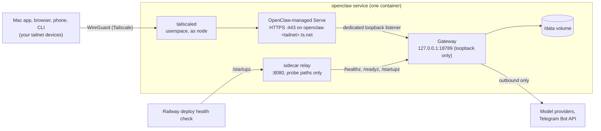

# Architecture

One Railway service with one volume, no public ingress. Tailscale runs inside
the same container as the Gateway, and OpenClaw manages Tailscale Serve itself.



The service has no Railway domain or TCP proxy. The Gateway listens only on
loopback, so nothing on Railway's private network can reach it either; the only
way in is Tailscale Serve, which OpenClaw configures and owns.

## The OpenClaw service

The image is the official OpenClaw image plus a few small files, Tailscale's two
binaries, and the tools skills need:

- `scripts/entrypoint.sh` (mostly comments and error messages) runs as root,
  validates the environment, prepares the volume, writes
  `config/openclaw.seed.json` and seeds Homebrew on first boot only, starts the
  sidecar, logs Tailscale in on first boot, and `exec`s into the stock startup
  as the unprivileged `node` user.
- `scripts/sidecar.mjs` runs `tailscaled` and relays Railway's health check
  (below).
- `tailscale` and `tailscaled`, copied from the pinned
  `tailscale/tailscale:v1.102.5` image in a multi-stage build. Dependabot tracks
  that `FROM` line along with OpenClaw's.
- `scripts/as-node.sh`, plus `openclaw` and `brew` wrappers built on it, run
  commands typed in a root `railway ssh` shell as `node`, so operator commands
  cannot leave root-owned state.
- `config/openclaw.seed.json` is the baseline config (below).
- A pinned baseline of skill tools (`gh`, `gog`, Claude Code, Codex, `jq`,
  `tmux`), ImageMagick for HEIC photos, and a Homebrew seed, with `HOME` on the
  volume so logins and updates persist. See [TOOLS.md](TOOLS.md).

After the privilege drop, everything runs as `node` (uid 1000):

```text
PID 1  tini -s --                      signal forwarding, zombie reaping
       └─ node docker-entrypoint.mjs    runs `openclaw doctor --fix` (state migrations)
          └─ execve → openclaw-gateway   the Gateway
       node sidecar.mjs                  started by the entrypoint before the exec
       └─ tailscaled                     userspace networking, state on /data
```

There is no setup web server, reverse proxy, or general process supervisor.
Railway restarts the container; the sidecar only makes sure a dead `tailscaled`
stops the container so that happens.

### Startup sequence

1. Entrypoint (root): refuse to start unless `OPENCLAW_GATEWAY_TOKEN` is set and
   ≥ 32 characters, and `PORT` (if set) differs from the Gateway's loopback
   port, 18789. Warn if `/data` is not a mount.
2. Create `/data/.openclaw`, `/data/home`, and `/data/tailscale` (mode 700)
   owned by `node`; hand back to `node` any file under them owned by someone
   else.
3. If `openclaw.json` does not exist, copy the seed. Existing config is never
   rewritten; OpenClaw's own clobber protection is never triggered. A config from
   the previous two-service layout (LAN bind, `gateway.publicOrigin`, a
   device-pair `publicUrl`) is refused with the four migration commands; see
   [UPGRADING.md](UPGRADING.md).
4. Start `scripts/sidecar.mjs` as `node`, without `TS_AUTHKEY` or
   `OPENCLAW_GATEWAY_TOKEN` in its environment. It starts `tailscaled`.
5. Wait for `tailscaled` to load its state. If it isn't logged in (first boot,
   or the node was removed from the tailnet), log in with `TS_AUTHKEY`, passed
   through a mode-600 temporary file (never on the command line, where `ps`
   would show it), then delete the file. If it is already logged in, the key is
   not used. Then unset `TS_AUTHKEY`.
6. `exec setpriv` → `node` user → `tini` → OpenClaw's `docker-entrypoint.mjs`,
   which runs Doctor migrations under exclusive state ownership, then `execve`s
   the Gateway with `--bind loopback --tailscale serve --auth token`.
7. The Gateway claims Tailscale Serve (HTTPS on 443 of the node's MagicDNS name,
   proxied to a dedicated ephemeral loopback listener). Startup succeeds only
   once the claim is active, and the claim is released when the Gateway stops.
   `/startupz` then turns 200.

The Gateway fails closed when Tailscale is logged out (`[tailscale] serve
failed: Logged out.`, exit 1), which is why the entrypoint logs in first.

### Why a seed config

The Gateway refuses to start when `gateway.mode` is missing (exit 78, "Treat this
as suspicious or clobbered config"), and Doctor's auto-created config doesn't
set it. A container that exits on first boot can't be reached with `railway ssh`
for onboarding. Non-interactive onboarding needs a model provider choice, so it
can't run unattended at first boot either. A one-time seed is the smallest fix
that keeps OpenClaw's clobbered-config safety check enabled; the alternative,
`gateway --allow-unconfigured`, would disable that check permanently.

The seed contains only infrastructure settings:

| Key | Value | Why |
| --- | --- | --- |
| `gateway.mode` | `local` | Required to start. |
| `gateway.bind` | `loopback` | Required by `gateway.tailscale.mode: serve` (OpenClaw rejects anything else: "gateway.bind must resolve to loopback when gateway.tailscale.mode=serve"). The `CMD` flag pins it too. |
| `gateway.tailscale.mode` | `serve` | OpenClaw runs Tailscale Serve itself. Separate CLI commands such as `openclaw qr` read this from the file, so it matters even though the `CMD` flag also sets it. |
| `gateway.auth` | token, env SecretRef `OPENCLAW_GATEWAY_TOKEN` | Token never written to disk. |
| `gateway.auth.rateLimit` | 10 failures / 60 s, 5-minute lockout | Failed-auth limiting per client and scope. |
| `gateway.terminal.enabled` | `false` | The operator terminal is a host shell inheriting the Gateway environment (including secrets). Enable it deliberately if you want it. |
| `gateway.nodes.pairing.sshVerify` | `false` | Disables SSH-verified node auto-approval; every node is approved by hand. |

There is no `gateway.publicOrigin` and no device-pair `publicUrl`: with managed
Serve, OpenClaw knows its own address. Browser loads from the `.ts.net` name are
private same-origin requests, and `openclaw qr` advertises the Serve URL.
Agent-level policy (tools, channel allowlists) is the operator's choice; see
[SECURITY.md](SECURITY.md).

## The sidecar

`scripts/sidecar.mjs` is about 40 lines with two jobs:

1. **Run `tailscaled`.** Userspace networking (Railway grants no TUN device or
   `NET_ADMIN`), as `node`, state in `/data/tailscale`, socket at the CLI's
   default path so `tailscale` and OpenClaw need no flags. If `tailscaled` exits,
   the sidecar sends SIGTERM to PID 1 (`tini`), the Gateway shuts down cleanly,
   and the container stops, so Railway restarts Tailscale and the Gateway
   together (≈2 s, verified).
2. **Relay the deploy health check.** Railway's check comes in over the
   container's network and can't reach a loopback-only Gateway, and OpenClaw has
   no separate probe port. The relay listens on `PORT` (8080) and forwards only
   `GET`/`HEAD` of `/healthz`, `/readyz`, and `/startupz`. Everything else is a
   404, including other methods on those paths, `/healthz/../v1/models`, and
   percent-encoded variants (verified). A general port forward would make every
   caller on Railway's private network look like a local client to the Gateway.

If the sidecar process itself dies, the relay stops and nothing restarts the
container. The Gateway keeps serving; Railway only probes at deploy time, so the
next deploy is where it would show.

## Private access: options considered

| Option | Verdict | Why |
| --- | --- | --- |
| **`tailscaled` in the OpenClaw container, `gateway.tailscale.mode: serve`** (chosen) | ✅ | OpenClaw's supported setup. HTTPS on the node's MagicDNS name with no configuration; tailnet identity sign-in; pairing codes and browser origins correct without an address variable; the Gateway is loopback-only. Costs: a second long-running process (`tailscaled`) and a health relay, both in the sidecar. |
| Separate Tailscale service, Serve in raw TCP mode (the previous layout) | Replaced | Worked with no forwarded headers to trust, but the Gateway had to bind to Railway's private network, users had to enter the tailnet address by hand (and fix it when Tailscale renamed the node `openclaw-1`), and tailnet identity sign-in was unavailable. Two services and two volumes. |
| Separate Tailscale service, Serve as an HTTP reverse proxy | ❌ | Adds `X-Forwarded-*` and `Tailscale-User-*` headers from a peer whose Railway private IP changes each deploy, so `trustedProxies` would have to cover the whole private network. |
| `gateway.bind: tailnet` | ❌ | Needs a tailnet interface; in userspace mode there is none. No HTTPS either. |
| Tailscale subnet router for Railway's private network | ❌ | Exposes every service in the environment to the tailnet, and `*.railway.internal` names don't resolve from tailnet clients. |
| SSH tunnel through Railway SSH (`ssh -L` via `ssh.railway.com`) | Fallback | No extra setup, but every client needs a Railway account, a registered SSH key, and a running tunnel. Kept as a break-glass path; see [DESKTOP.md](DESKTOP.md#fallback-railway-ssh-tunnel). |
| Railway public domain + token (the original template) | ❌ | Public exposure of the Gateway. |

This replaces the original brief's requirement of Tailscale as a separate
service; the change was approved on 2026-10-08 (see
[ACCEPTANCE_CRITERIA.md](ACCEPTANCE_CRITERIA.md)).

## Why the proxy-attribution error cannot recur

The original error came from `src/gateway/ingress-attribution.ts`: a peer that
sends forwarded or `Tailscale-*` headers without being in
`gateway.trustedProxies` is rejected with *"Proxy client attribution is
required…"*.

In this layout no proxy ever talks to the ordinary Gateway listener:

- **Tailnet traffic** arrives through OpenClaw-managed Serve, which proxies to a
  dedicated ephemeral loopback listener that OpenClaw creates for it. OpenClaw
  knows that listener's provenance, so Tailscale's forwarded headers are expected
  there, and identity headers are verified with `tailscale whois` before they
  count. Startup fails closed rather than sharing that listener with anything
  else.
- **The ordinary listener** (`127.0.0.1:18789`) is reachable only from inside
  the container. Forwarded or Tailscale headers sent to it are rejected with 403
  even when the request carries a valid token (verified).
- **The health relay** forwards only the three unauthenticated probe paths and
  sends no forwarded headers.

`gateway.trustedProxies` stays empty. Don't add `127.0.0.1` to it: that would let
every process in the container claim to be a proxy.

The image tests check the ordinary listener from inside the container:

| Request to `127.0.0.1:18789` | Result |
| --- | --- |
| no token / wrong token | 401 |
| token, no proxy headers | **200** |
| `Tailscale-User-Login` + forwarded headers, no token | **403** "Proxy client attribution is required" |
| token + `X-Forwarded-For` | **403** |

## Authentication model

Enforced by the Gateway:

1. **Tailnet identity** (browsers through Serve): with `gateway.tailscale.mode:
   serve`, `gateway.auth.allowTailscale` defaults to `true`. A browser that
   reaches the Serve URL signs in to the Control UI with its Tailscale identity:
   no token and no device approval (verified; no pairing entry is created). Only
   the Control UI WebSocket and avatar reads accept this; HTTP API endpoints
   (`/v1/*`, `/tools/invoke`, …) always require the token.
2. **Shared token**: every other WebSocket `connect` and authenticated HTTP
   request must present `OPENCLAW_GATEWAY_TOKEN`. `--auth token` is pinned in the
   `CMD`.
3. **Device pairing** for node-role connections (the Mac app's node, node hosts,
   phones): each signs the connect challenge with its own Ed25519 key and stays
   pending until an operator runs `openclaw devices approve <requestId>`.
   Tailnet identity does not bypass node pairing.

Tailscale is the network layer: only tailnet devices your access policy lets
reach the node on 443 can connect at all, and with identity sign-in on, that
policy is also who can open the dashboard. See
[SECURITY.md](SECURITY.md#tailnet-identity-sign-in).

## Health, restarts, and what Railway owns

| Concern | Owner | Mechanism |
| --- | --- | --- |
| Deploy health gate | Railway | `GET /startupz` on `$PORT` = 8080 (Host `healthcheck.railway.app`), relayed by the sidecar to the loopback Gateway; timeout 600 s (300 s from the template). 200 once the Gateway admits traffic, which includes Serve being up; ignores channel health. *(Through the relay on Railway: not yet verified live.)* |
| Restart on exit | Railway | `restartPolicyType: ALWAYS`. Required: in external-supervisor mode a config change that needs a restart makes the Gateway exit 0 ("full process restart (supervisor restart)"), and a dead `tailscaled` also stops the container with exit 0. |
| Graceful stop | Railway + container | Railway sends SIGTERM, then SIGKILL after `drainingSeconds: 330` (OpenClaw's own stop budget). `tini` forwards the signal; the Gateway drains, releases its Serve claim, and exits 0 (≈60 ms when idle). |
| Crash recovery | Railway | A killed Gateway ends `tini`, the container exits non-zero, Railway restarts it. A killed `tailscaled` makes the sidecar stop the container. |
| Tailscale login | Container | Node key and certificates on `/data/tailscale`; `TS_AUTHKEY` is used only when the node is logged out. Restarts reuse the saved login (verified). |
| State migrations | Container | OpenClaw's entrypoint runs `doctor --fix` before every Gateway start. |
| Single writer | Railway + OpenClaw | One replica. Railway never runs two deployments with the same volume; OpenClaw 2026.9.8 also enforces single-owner Gateway startup. |
| Post-deploy liveness | **Nobody, by default** | Railway checks health only during a deploy. A Gateway that is running but wedged is not restarted automatically. Monitor `https://openclaw.<tailnet>.ts.net/readyz` from a tailnet device if you need this. |

Because only one deployment may hold the volume, every redeploy has a short
outage: Railway stops the old container before starting the new one. A failed
health check therefore means the service is down, not rolled back. `/startupz`
was chosen over `/readyz` for that reason: with an invalid Telegram token,
`/readyz` returns 503 while `/startupz` returns 200 (observed), and a `/readyz`
gate would fail every deploy until the channel was fixed.

## Tailscale in the container

- **Identity persists** on the volume (`TS_STATE_DIR=/data/tailscale`):
  redeploys keep the same node and MagicDNS name. `TS_HOSTNAME=openclaw` sets the
  name on first login; if your tailnet already has a machine named `openclaw`,
  Tailscale names this one `openclaw-1`. Nothing in the template depends on the
  name.
- **HTTPS certificates must be enabled** for the tailnet. There is no plaintext
  fallback port. The first HTTPS request after a node's first login took ≈15.6 s
  while Tailscale issued the certificate (locally); later requests ≈16 ms. The
  certificate is stored with the node state.
- **`TS_DEBUG_MTU=1236`** lowers the tunnel MTU to fit Railway's 1316-byte
  network MTU (1316 − 80 bytes of WireGuard/UDP/IPv6 overhead). Without it,
  full-size packets were lost on the way out of Railway, so TLS handshakes took
  0.6–1.7 s and transfers ran near 10 KB/s, while small requests looked fine.
  *(Measured with the previous layout; not yet re-verified on Railway with
  Tailscale in this container.)*
- **Peer API.** In userspace mode `tailscaled` listens on `0.0.0.0:<random>` TCP
  for Tailscale's peer API (Taildrop and similar). It rejects anything that isn't
  an authenticated tailnet peer (`peerapi: unknown peer`); the previous separate
  Tailscale container had the same listener.
- `tailscale` works in a `railway ssh` shell without flags (default socket path);
  run it as `node` (`as-node tailscale status`) to match the daemon's owner.

## Requirements and limits

- **Tailnet MagicDNS and HTTPS certificates** enabled.
- **One Gateway instance.** OpenClaw does not cluster, and Railway volumes can't
  be shared between replicas.
- **Image size.** ≈6 GB uncompressed (the official image is ≈5 GB). The first
  build on Railway pulls it; later builds reuse cached layers.
- **Resources.** Idle memory is ≈0.9 GB for the Gateway in local tests, plus
  `tailscaled` and the sidecar. Plan on 2 GB memory and 1 vCPU minimum; more for
  browser automation or heavy agent fleets. Start with a 5 GB volume and watch
  `/data` growth (media, SQLite, workspace, and tools you install: Homebrew
  dependencies alone can take a few GB).
