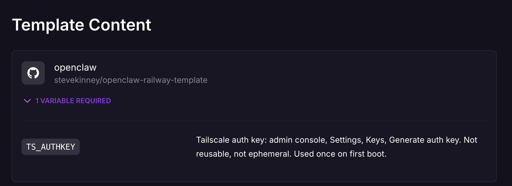
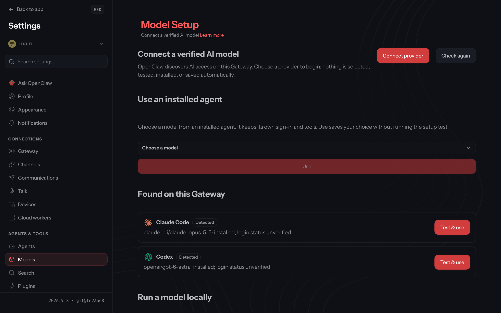
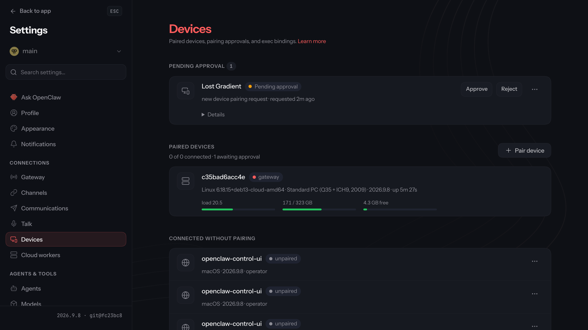

# Quickstart

From nothing to the macOS app talking to a private OpenClaw Gateway on Railway.
About 15 minutes, most of it waiting for the first build.

You need:

- A Railway account on a paid plan, and the [Railway CLI](https://docs.railway.com/cli)
  (`brew install railway`, then `railway login`).
- A Tailscale tailnet with **MagicDNS** and
  [**HTTPS certificates**](https://tailscale.com/kb/1153/enabling-https) turned on.
- A model provider API key (Anthropic is shown below).

## 1. Get a Tailscale auth key

Admin console → **Settings → Keys → Generate auth key**: not reusable, not
ephemeral, 1-day expiry. If your access policy defines `tag:openclaw`
([TAILSCALE.md](TAILSCALE.md#1-prepare-the-tailnet)), add that tag; tagged
machines never expire and get only the access your policy grants them.

## 2. Deploy the template

Open the [OpenClaw Private Gateway template](https://railway.com/deploy/openclaw-private-gateway)
(or click **Deploy on Railway** in the [README](../README.md)) and fill in the
one variable it asks for:

| Variable | Value |
| --- | --- |
| `TS_AUTHKEY` | the key from step 1 |



The template generates the Gateway token (`OPENCLAW_GATEWAY_TOKEN`). Wait for
the `openclaw` service to turn green (≈4 minutes; the first build pulls a large
image). On first boot the container logs in to your tailnet with the key, and a
machine named `openclaw` appears. After that, the node key on the volume logs
it in; the auth key is never used again.

The Gateway is then at `https://openclaw.<your-tailnet>.ts.net/`. The first
request takes about 15 seconds while Tailscale issues the certificate. If the
name `openclaw` was already taken, the machine is `openclaw-1` and the address
follows (`https://openclaw-1.<your-tailnet>.ts.net/`); nothing needs editing. To
get the plain name back, remove the stale machine and rename this one in the
admin console.

The deploy log names the address either way:

```
openclaw-railway: logged in to Tailscale as openclaw-1 (openclaw was already taken in this tailnet)
openclaw-railway: the Gateway will be at https://openclaw-1.<your-tailnet>.ts.net/
```

## 3. Link the CLI and open SSH

From any directory:

```bash
railway link                                     # pick the new project
railway ssh keys add --key ~/.ssh/id_ed25519.pub # once per machine
railway ssh --service openclaw -- openclaw health
```

The first `railway ssh` asks you to trust `ssh.railway.com`'s host key. Railway
doesn't publish fingerprints, so accept it on first use.

## 4. Add your model provider and onboard

Copy your Anthropic key, then:

```bash
pbpaste | tr -d '\n' | railway variable set ANTHROPIC_API_KEY --stdin --service openclaw
```

When that deploy is green:

```bash
railway ssh --service openclaw -- openclaw onboard --non-interactive --accept-risk --skip-health \
  --mode local --auth-choice apiKey --secret-input-mode ref \
  --gateway-auth token --gateway-token-ref-env OPENCLAW_GATEWAY_TOKEN \
  --gateway-bind loopback --skip-channels --no-install-daemon
```

The Gateway restarts itself once to apply the result. Check that the agent
answers:

```bash
railway ssh --service openclaw -- openclaw agent --agent main --message "Reply with exactly: OK"
```

For another provider, set its key variable instead (for example
`OPENAI_API_KEY`) and change `--auth-choice`; see `openclaw onboard --help`.

## 5. Open the dashboard

On a tailnet device, open `https://openclaw.<your-tailnet>.ts.net/`. It signs
you in with your Tailscale identity: no token, no device approval. Anyone your
Tailscale access policy lets reach the machine can do the same, so check the
policy ([TAILSCALE.md](TAILSCALE.md)).

If you open it before step 4, it starts on **Model Setup**, because no model is configured yet:



## 6. Connect the macOS app

Keep the Gateway token in your Keychain, then point the app at the Gateway:

```bash
railway variable list --service openclaw --json | jq -j .OPENCLAW_GATEWAY_TOKEN | \
  security add-generic-password -U -a openclaw-railway -s openclaw-railway-gateway-token -w "$(cat)"
security find-generic-password -s openclaw-railway-gateway-token -w | tr -d '\n' | \
  /Applications/OpenClaw.app/Contents/MacOS/openclaw-mac primary set \
    --direct-url wss://openclaw.<your-tailnet>.ts.net --token-stdin
```

`primary set` replaces the app's current primary connection. To add the Gateway
alongside it instead, use `openclaw-mac gateway add Railway --url https://openclaw.<your-tailnet>.ts.net --token-stdin`.
It returns right away with the connection `disconnected` until you approve the Mac in step 7; then run `openclaw-mac gateway reconnect Railway`.
In the app you can also do it by hand: **Connection… → Remote (another host)**.

## 7. Approve the Mac

```bash
railway ssh --service openclaw -- openclaw devices list
railway ssh --service openclaw -- openclaw devices approve <requestId>   # each pending request from your Mac
```

Or approve it in the dashboard: **Settings → Devices**, then **Approve** next to your Mac under **Pending approval**.



The app connects within a few seconds. It may then ask you to approve its own
node capabilities, which let the agent run commands on your Mac, including
shell commands. Review them before approving; see
[SECURITY.md](SECURITY.md#local-node-permissions-the-mac).

For a phone, run `railway ssh --service openclaw -- openclaw qr` and scan the
code in the OpenClaw app; it carries `wss://openclaw.<your-tailnet>.ts.net`
with full access.

## 8. Finish

- **Tailscale:** if you didn't tag the machine, disable key expiry on `openclaw`
  in the admin console, or it leaves your tailnet after 180 days.
- **Telegram (optional):** see [DEPLOYMENT.md](DEPLOYMENT.md#10-connect-telegram).
- **Backups:** `openclaw` → **Backups** → Daily. The volume also holds the
  Tailscale node key.
- **Audit:** `railway ssh --service openclaw -- openclaw security audit` should
  report 0 critical and one expected warning, `gateway.trusted_proxies_missing`
  ([why](SECURITY.md#security-audit)).

Something wrong? [TROUBLESHOOTING.md](TROUBLESHOOTING.md).
